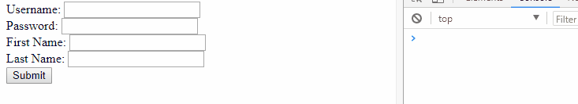

# React Clean Forms

[](https://travis-ci.org/TobiasWalle/clean-forms)
[](https://coveralls.io/github/TobiasWalle/clean-forms?branch=master)
[](https://github.com/semantic-release/semantic-release)
[](https://badge.fury.io/js/clean-forms)

React Forms solved ✔

## Features

* Input Validation
* Dirty/Touched state tracking
* Full Typescript support
* Controlled Forms
* Clean Interface
* Can be used with React State, Redux, etc...

## Example



```typescript
import * as React from 'react';
import {
  FormState, FieldGroup, Form, createField,
  ValidationDefinition, ValidationFunction
} from 'clean-forms';

interface Model {
  username: string;
  password: string;
  realName: {
    first: string;
    last: string;
  };
}

type MyFormState = FormState<Model>;

export class MyForm extends React.Component<{}, MyFormState> {
  public state: MyFormState = {
    model: {
      username: '',
      password: '',
      realName: {
        first: '',
        last: '',
      }
    }
  };
  private validation: ValidationDefinition<Model> = {
    username: required,
    password: required,
    realName: {
      first: required,
      last: required,
    }
  };

  public render() {
    return (
      <Form
        state={this.state}
        validation={this.validation}
        onChange={this.onChange}
        onValidSubmit={() => console.log('Submit Successful')}
      >
        <Input name={'username'} label={'Username'}/>
        <Input name={'password'} label={'Password'} type={'password'}/>
        <FieldGroup name={'realName'}>
          <Input name={'first'} label={'First Name'}/>
          <Input name={'last'} label={'Last Name'}/>
        </FieldGroup>
        <div>
          <button>Submit</button>
        </div>
      </Form>
    );
  }

  private onChange = (newState: MyFormState): void => {
    this.setState(newState);
  };
}

// Validation Functions
const required: ValidationFunction<string> =
  ({ value }) => value === ''
    ? 'The field is required'
    : null;

// Create the Input
export interface InputProps extends React.InputHTMLAttributes<HTMLInputElement> {
  label: string;
}

export const Input = createField<string | number, InputProps>(({
  input: {
    name,
    onFocus,
    onChange,
    onBlur,
    error,
    touched
  },
  custom
}) => {
  return (
    <div>
      <label>
        <span>{custom.label}: </span>
        <input
          name={name}
          onChange={event => onChange(event.target.value)}
          onFocus={onFocus}
          onBlur={onBlur}
          {...custom}
        />
        <span>{touched ? error : ''}</span>
      </label>
    </div>
  );
});

```

